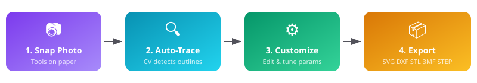
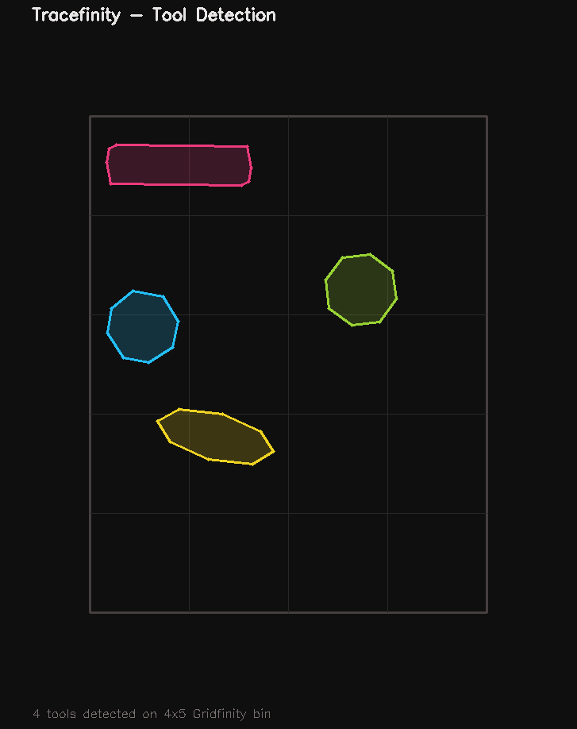
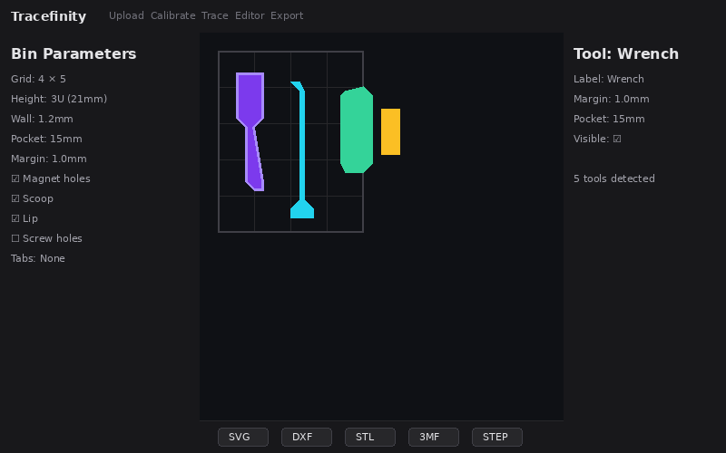
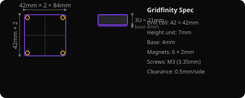

<div align="center">


**Turn a photo of your tools into custom Gridfinity inserts and foam cutouts.**

Self-hosted · No cloud · No signup · Docker-ready

[Quick Start](#quick-start) · [How It Works](#how-it-works) · [Export Formats](#export-formats) · [Self-Hosting](#deployment) · [Development](#development)

</div>

---

## Overview

Tracefinity is a self-hosted web app that takes a photo of your tools laid on a sheet of paper, automatically detects and traces each tool's outline, lets you customize a Gridfinity bin around them, and exports the result as SVG, DXF, STL, 3MF, or STEP files.

It's a self-hosted clone of [tooltrace.ai](https://tooltrace.ai) — no accounts, no cloud, no subscription. Just you, your tools, and your 3D printer.

<div align="center">

</div>

## How It Works

### 1. Snap a Photo
Place your tools on a sheet of **US Letter (8.5×11")** or **A4** paper and take a photo from directly above. The paper provides a known reference for scale calibration.

### 2. Auto-Trace
OpenCV detects the paper boundary (for scale) and traces each tool's outline. The pipeline uses multiple strategies — bright-region thresholding, Canny edges, adaptive thresholding, Otsu, floodfill, and GrabCut — and picks the best result. Tool outlines are smoothed with Gaussian blur + Chaikin corner-cutting for professional-looking curves.

### 3. Customize
Fine-tune everything in the built-in SVG editor:
- **Drag vertices** to adjust outlines
- **Double-click** an edge to add a vertex
- Set **Gridfinity parameters**: grid size, height, wall thickness, pocket depth, magnet holes, screw holes, scoop, tabs, lip, dividers, labels
- **Per-tool overrides**: custom margins, pocket depths, labels, visibility
- **Grid snapping** for precise placement
- Undo/redo support

### 4. Export
Download your design in the format you need:

<div align="center">

</div>

| Format | Use Case |
|---|---|
| **SVG** | 2D vector for laser cutting, foam cutting, or web preview |
| **DXF** | 2D CAD for laser cutters, CNC, AutoCAD |
| **STL** | 3D mesh for 3D printing (PrusaSlicer, Cura, Bambu Studio) |
| **3MF** | 3D mesh with metadata (advanced 3D printing) |
| **STEP** | 3D CAD for Fusion 360, FreeCAD, SolidWorks, Onshape |

## Quick Start

```bash
git clone https://github.com/neilyboy/tracefinity.git
cd tracefinity
docker compose up --build
```

Then open **http://localhost:8000** in your browser. That's it.

### Photo Tips for Best Results

- Use **even lighting** — avoid shadows on the paper
- Place paper on a **dark, contrasting surface** so the boundary is detectable
- Shoot from **directly above** the paper
- Ensure tools are **fully within** the paper boundary
- **Dark tools on white paper** work best
- Avoid overlapping tools

> **Detection not perfect?** You can manually drag the 4 paper corners to the correct positions if auto-detection fails, and edit any tool outline in the SVG editor.

## Detection Demo

<div align="center">

</div>

*4 tools automatically detected and traced from a photo, overlaid on a 4×5 Gridfinity bin.*

## Editor Screenshot

<div align="center">

</div>

*Interactive SVG editor with grid overlay, tool outlines, bin parameters, and export bar.*

## Gridfinity Specification

Tracefinity follows the standard [Gridfinity spec](https://gridfinity.xyz/):

<div align="center">

</div>

- **Unit cell**: 42 × 42mm
- **Height unit**: 7mm
- **Base (stacking socket)**: 4mm
- **Magnet holes**: 6mm diameter × 2mm depth in corners
- **Screw holes**: M3 (3.35mm)
- **Clearance**: 0.5mm per side

## Deployment

### Docker (Recommended)

The app runs as a single container with everything bundled:

- **Frontend**: React + TypeScript (Vite static build, served by FastAPI)
- **Backend**: Python FastAPI (OpenCV for vision, build123d for 3D generation)
- **Storage**: SQLite database + filesystem for images/exports

```yaml
# docker-compose.yml
services:
  tracefinity:
    build: .
    ports:
      - "8000:8000"
    volumes:
      - ./data:/data
    environment:
      TRACEFINITY_DATA_DIR: /data
      TRACEFINITY_MAX_UPLOAD_MB: 25
```

### Configuration

| Environment Variable | Default | Description |
|---|---|---|
| `TRACEFINITY_DATA_DIR` | `/data` | Where uploaded images, DB, and exports are stored |
| `TRACEFINITY_MAX_UPLOAD_MB` | `25` | Max image upload size in MB |
| `TRACEFINITY_MIN_TOOL_AREA_MM2` | `100` | Minimum tool area to detect (filters noise) |
| `TRACEFINITY_MAX_OUTLINE_VERTICES` | `80` | Max vertices per tool outline |
| `TRACEFINITY_PORT` | `8000` | Host port to expose (set in environment, not container) |

### Data Persistence

All data is stored in the mounted volume:
```
data/
├── images/     # uploaded + rectified images
├── exports/    # generated export files
└── db/         # SQLite database (saved designs)
```

## Development

### Prerequisites
- Python 3.10–3.12
- Node.js 18+
- Docker (for deployment)

### Local Development

```bash
# Backend
cd backend
python -m venv ../.venv
source ../.venv/bin/activate
pip install -e ".[dev]"
TRACEFINITY_DATA_DIR=../data uvicorn app.main:app --reload --port 8000 --app-dir .

# Frontend (separate terminal)
cd frontend
npm install
npm run dev
```

The Vite dev server proxies `/api` and `/data` to the backend at `localhost:8000`.

### Running Tests

```bash
source .venv/bin/activate
TRACEFINITY_DATA_DIR=./data python -m pytest backend/tests/ -v
```

### Regenerating README Graphics

```bash
python docs/images/generate_graphics.py
```

## Tech Stack

| Layer | Technology |
|---|---|
| **Backend** | FastAPI, OpenCV (computer vision), build123d (parametric CAD), ezdxf (DXF), trimesh (3MF), SQLModel/SQLite |
| **Frontend** | React 18, TypeScript, Vite, Zustand (state management) |
| **CAD Engine** | OCP/OpenCASCADE (via build123d) for STEP/STL/3MF generation |
| **Deployment** | Docker, Docker Compose |

## Project Structure

```
tracefinity/
├── backend/
│   ├── app/
│   │   ├── cv/              # Computer vision pipeline
│   │   │   ├── paper_detect.py   # Paper detection + rectification
│   │   │   ├── tool_detect.py    # Tool outline extraction + smoothing
│   │   │   └── pipeline.py       # Orchestration
│   │   ├── gridfinity/      # Gridfinity bin generation
│   │   │   ├── bin_builder.py    # Parametric bin construction
│   │   │   ├── pockets.py        # Tool pocket generation
│   │   │   └── constants.py      # Gridfinity spec constants
│   │   ├── exporters/       # Export format generators
│   │   │   ├── svg.py             # SVG (2D vector)
│   │   │   ├── dxf.py             # DXF (2D CAD)
│   │   │   ├── mesh.py            # STL + 3MF (3D mesh)
│   │   │   └── step.py            # STEP (3D CAD)
│   │   ├── routers/         # API endpoints
│   │   ├── storage/         # SQLite persistence
│   │   ├── schemas.py       # Pydantic models
│   │   └── main.py          # FastAPI app
│   └── tests/               # pytest test suite
├── frontend/
│   ├── src/
│   │   ├── components/      # React components
│   │   ├── api/             # API client
│   │   └── types.ts         # TypeScript types
│   └── package.json
├── docs/images/             # README graphics
├── samples/                 # Sample test images
├── Dockerfile               # Multi-stage build
├── docker-compose.yml
└── README.md
```

## API Reference

| Endpoint | Method | Description |
|---|---|---|
| `/api/health` | GET | Health check |
| `/api/trace` | POST | Upload image, get tool outlines |
| `/api/rectify` | POST | Re-rectify with manual corners |
| `/api/preview` | POST | Generate preview image |
| `/api/export` | POST | Export design (SVG/DXF/STL/3MF/STEP) |
| `/api/designs` | GET | List saved designs |
| `/api/designs` | PUT | Save a design |
| `/api/designs/{id}` | GET | Load a design |
| `/api/designs/{id}` | DELETE | Delete a design |

## License

MIT

---

<div align="center">

Made with ❤️ for the Gridfinity community

</div>
